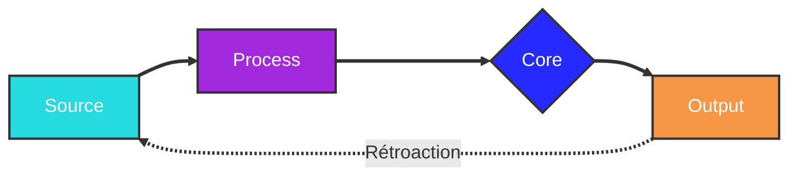

# Charte de Style Mermaid

## Palette

| Rôle       | Classe    | Couleur   | Texte | Usage                                |
| ---------- | --------- | --------- | ----- | ------------------------------------ |
| Entrée     | `source`  | `#25dbe0` | Blanc | Sources, déclencheurs, début de flux |
| Traitement | `process` | `#a329de` | Blanc | Middleware, ETL, processing          |
| Central    | `core`    | `#272aff` | Blanc | BDD, stockage, décisions             |
| Sortie     | `output`  | `#f79645` | Blanc | Serving, dashboards, résultats       |

## Flèches

| Type | Syntaxe | Usage |
|------|---------|-------|
| Épaisse | `==>` | Flux principal |
| Épaisse + label | `== label ==>` | Flux principal annoté |
| Pointillée | `-.->` | Rétroaction, flux secondaire |
| Pointillée + label | `-.->|label|` | Flux secondaire annoté |
| Neutre | `---` | Lien sans direction |

## Bloc à copier

```
%% Classes de style
classDef source  fill:#25dbe0,stroke:#333,stroke-width:2px,color:#fff
classDef process fill:#a329de,stroke:#333,stroke-width:2px,color:#fff
classDef core    fill:#272aff,stroke:#333,stroke-width:2px,color:#fff
classDef output  fill:#f79645,stroke:#333,stroke-width:2px,color:#fff

%% Assignation (adapter les noms de nœuds)
class NoeudA,NoeudB source
class NoeudC,NoeudD process
class NoeudE core
class NoeudF,NoeudG output

%% Liens épais par défaut
linkStyle default stroke:#333,stroke-width:3px

%% Pointillés sur liens spécifiques (index 0-based)
%% linkStyle 2,5 stroke:#333,stroke-width:2px,stroke-dasharray:5
```

## Exemple




## Limitations

Les `erDiagram` et `sequenceDiagram` ne supportent pas `classDef`/`style` — cette charte s'applique uniquement aux `flowchart`.
