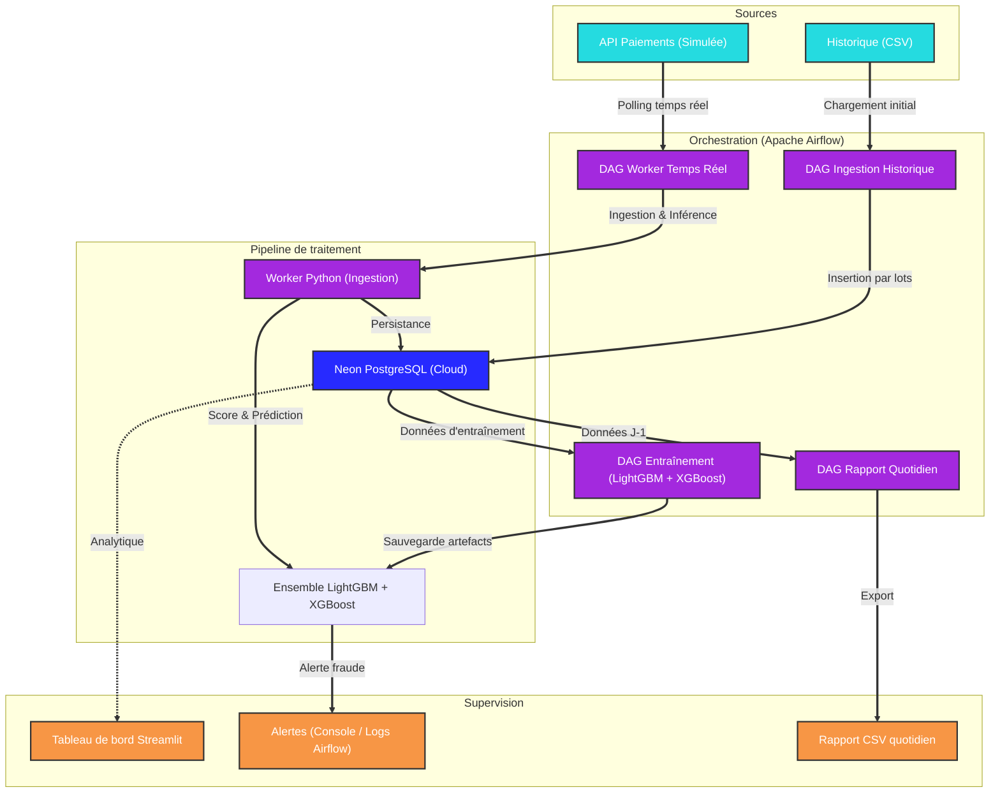

# Architecture et structure du projet 🏗️

## 1. Schéma d'architecture (flux de données)

Ce schéma décrit le flux de données depuis l'ingestion jusqu'à la visualisation, illustrant un pipeline de détection temps réel orchestré par Airflow.




## 2. Justification des choix technologiques

*   **Ensemble LightGBM + XGBoost — soft voting (Modèle ML)** : Deux modèles de gradient boosting aux stratégies complémentaires. LightGBM croît *leaf-wise* (spécialiste des patterns rares, capte les fraudes atypiques) ; XGBoost croît *level-wise* (arbres équilibrés, robuste sur la majorité des transactions normales). La moyenne de leurs probabilités (*soft voting*) réduit la variance des prédictions sur les cas limites. Le déséquilibre de classes (≈ 0,38 % de fraudes) est géré nativement via `scale_pos_weight`, sans SMOTE. Entraînable en local sur le dataset complet en < 1 min. — *Approche initiale TabPFN v2 abandonnée : limite de 100M cellules/jour et dépendance API incompatibles avec l'itération rapide. Code archivé dans `archive/train_tabpfn_v1.py`.*
*   **Apache Airflow (Orchestration)** : Planification, monitoring et gestion des dépendances entre les tâches du pipeline. Remplace les scripts manuels par des DAGs reproductibles et observables via l'interface web.
*   **Neon PostgreSQL (Base de données)** : Base PostgreSQL serverless cloud. Mêmes propriétés ACID qu'un PostgreSQL local, avec en plus : disponibilité managée, backups automatiques, scaling automatique et accès distant sécurisé (SSL). Sert de backend pour les données applicatives ET les métadonnées Airflow.
*   **Streamlit (Visualisation)** : Mise en oeuvre rapide d'un tableau de bord interactif en Python pour le reporting métier.
*   **Docker Compose (Infrastructure)** : Garantit la reproductibilité de l'ensemble de l'infrastructure (Airflow, Dashboard) quel que soit l'environnement de déploiement. La base de données étant externalisée sur Neon, Docker Compose ne gère plus le stockage.

## 3. Performances du modèle (dernière évaluation — 31/03/2026)

Entraînement sur **444 597 transactions** (80 % du dataset), évaluation sur **55 575 transactions** dont **214 fraudes** (taux réel : ≈ 0,38 %).

| Métrique | Valeur |
|---|---|
| AUC-PR *(Area Under Precision-Recall Curve)* | **0.8827** |
| Recall fraude (seuil 0.5) | **0.87** |
| Précision fraude (seuil 0.5) | 0.63 |
| F1 fraude (seuil 0.5) | 0.73 |
| Temps d'entraînement (local) | ≈ 43 s |

**Lecture** : l'AUC-PR de 0.88 indique un fort pouvoir discriminant sur l'ensemble des seuils, malgré un déséquilibre de classes de 258:1. Le recall de 0.87 signifie que 87 % des fraudes sont détectées à seuil neutre (0.5), au-dessus de l'objectif métier fixé à 75 %.

> **Comparaison avec l'approche initiale (TabPFN v2)** : AUC-PR 0.63 → 0.88 (+39 %), recall 0.75 → 0.87, évaluation sur 4 fraudes → 214 fraudes (fiabilité statistique réelle).

## 4. Structure du projet

```text
/
├── .env.example                # Template de configuration (variables d'environnement)
├── .gitignore                  # Fichiers exclus du versionnement
├── Dockerfile                  # Image Docker Airflow personnalisée
├── docker-compose.yml          # Infrastructure as Code (Airflow + Dashboard)
├── requirements.txt            # Dépendances Python
├── dags/                       # DAGs Airflow (orchestration du pipeline)
│   ├── dag_ingestion_historique.py
│   ├── dag_entrainement.py
│   ├── dag_worker_temps_reel.py
│   └── dag_rapport_quotidien.py
├── data/                       # Données sources pour la simulation
│   └── rapports/               # Rapports quotidiens exportés (CSV)
├── database/                   # Schéma SQL de référence (init.sql)
├── src/
│   ├── app/                    # Tableau de bord d'observabilité (Streamlit)
│   ├── ingestion/              # Pipeline d'ingestion et transformation
│   ├── ml/                     # Logique d'entraînement et d'inférence (LightGBM + XGBoost)
│   └── utils/                  # Modules de connexion et configuration
├── archive/
│   └── train_tabpfn_v1.py      # Approche initiale TabPFN v2 (archivée)
├── ARCHITECTURE.md             # Ce fichier
├── PIPELINE_QUALITY.md         # Documentation qualité et observabilité
├── PROJECT.md                  # Énoncé du projet (sujet)
└── README.md                   # Guide d'installation et présentation
```
