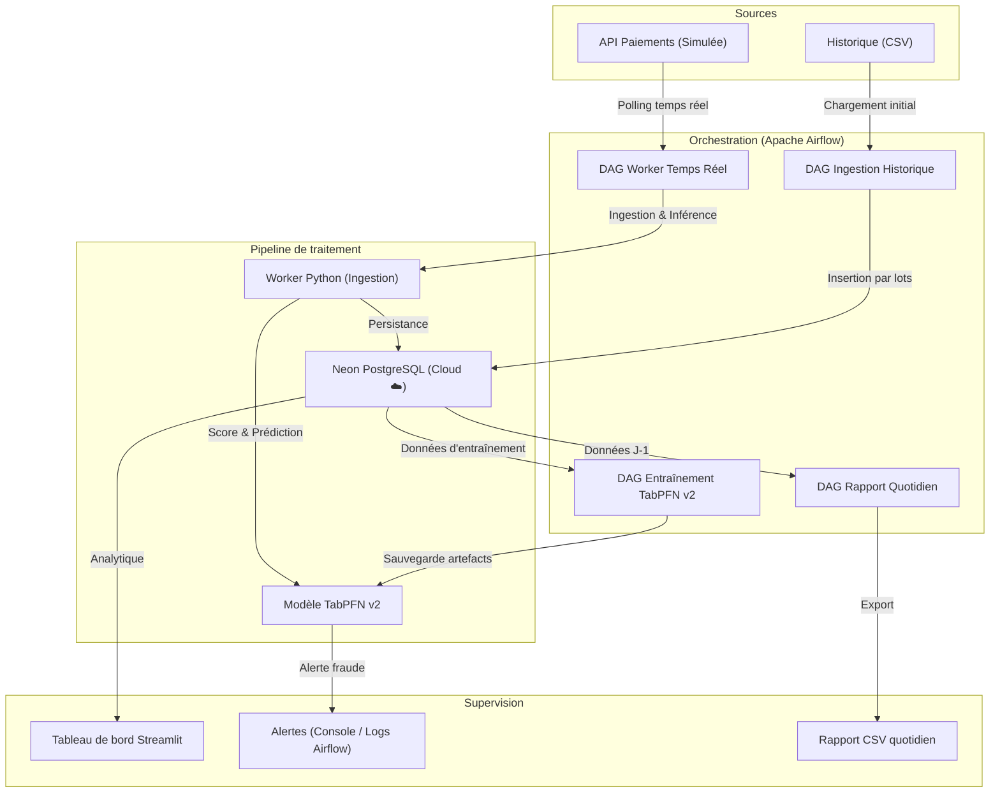

# Architecture et structure du projet 🏗️

## 1. Schéma d'architecture (flux de données)

Ce schéma décrit le flux de données depuis l'ingestion jusqu'à la visualisation, illustrant un pipeline de détection temps réel orchestré par Airflow.




## 2. Justification des choix technologiques

*   **TabPFN v2 (Modèle ML)** : Modèle fondation pré-entraîné pour les données tabulaires. Surpasse les Random Forest et Gradient Boosting sur les petits et moyens datasets sans nécessiter de tuning d'hyperparamètres. Idéal pour un POC de détection de fraude.
*   **Apache Airflow (Orchestration)** : Planification, monitoring et gestion des dépendances entre les tâches du pipeline. Remplace les scripts manuels par des DAGs reproductibles et observables via l'interface web.
*   **Neon PostgreSQL (Base de données)** : Base PostgreSQL serverless cloud. Mêmes propriétés ACID qu'un PostgreSQL local, avec en plus : disponibilité managée, backups automatiques, scaling automatique et accès distant sécurisé (SSL). Sert de backend pour les données applicatives ET les métadonnées Airflow.
*   **Streamlit (Visualisation)** : Mise en oeuvre rapide d'un tableau de bord interactif en Python pour le reporting métier.
*   **Docker Compose (Infrastructure)** : Garantit la reproductibilité de l'ensemble de l'infrastructure (Airflow, Dashboard) quel que soit l'environnement de déploiement. La base de données étant externalisée sur Neon, Docker Compose ne gère plus le stockage.

## 3. Structure du projet

```text
/
├── .env.example                # Template de configuration (variables d'environnement)
├── .gitignore                  # Fichiers exclus du versionnement
├── Dockerfile                  # Image Docker Airflow personnalisée
├── docker-compose.yml          # Infrastructure as Code (Airflow + Dashboard)
├── requirements.txt            # Dépendances Python
├── dags/                       # DAGs Airflow (orchestration du pipeline)
│   ├── dag_ingestion_historique.py
│   ├── dag_entrainement.py
│   ├── dag_worker_temps_reel.py
│   └── dag_rapport_quotidien.py
├── data/                       # Données sources pour la simulation
│   └── rapports/               # Rapports quotidiens exportés (CSV)
├── database/                   # Schéma SQL de référence (init.sql)
├── src/
│   ├── app/                    # Tableau de bord d'observabilité (Streamlit)
│   ├── ingestion/              # Pipeline d'ingestion et transformation
│   ├── ml/                     # Logique d'entraînement et d'inférence (TabPFN v2)
│   └── utils/                  # Modules de connexion et configuration
├── ARCHITECTURE.md             # Ce fichier
├── PIPELINE_QUALITY.md         # Documentation qualité et observabilité
├── PROJECT.md                  # Énoncé du projet (sujet)
└── README.md                   # Guide d'installation et présentation
```
