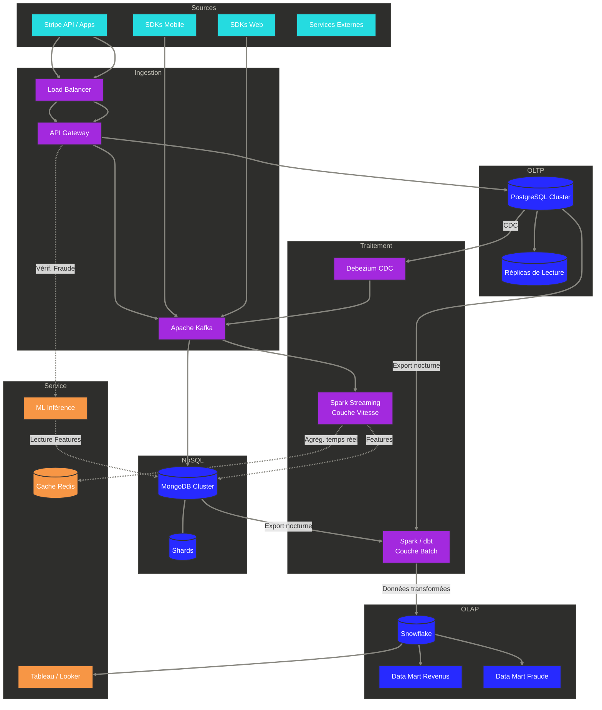

# Diagramme d'Architecture de Données

L'architecture suit une approche **Modern Data Stack** combinée à un pattern **Lambda Architecture** : une couche vitesse pour les besoins temps réel (fraude, dashboards live) et une couche batch pour l'analytique lourde et le reporting réglementaire.

---

## 1. Architecture Cible

---

## 2. Flux de Données

L'architecture supporte quatre flux principaux :

- **Flux transactionnel (chemin chaud) :** Les applications écrivent dans PostgreSQL (OLTP) pour garantir la conformité ACID. Debezium capture les changements via CDC et les pousse vers Kafka, sans impacter les performances de la base transactionnelle.
- **Flux non structuré :** Les logs et événements des SDKs sont poussés directement vers Kafka, puis consommés et stockés dans MongoDB pour l'analyse et le Feature Store ML.
- **Flux analytique (chemin froid) :** Spark/dbt traite les données brutes depuis les archives et les charge dans Snowflake (OLAP). Les jointures complexes et agrégations alimentent les outils BI.
- **Flux temps réel (couche vitesse) :** Spark Streaming consomme depuis Kafka pour calculer des fenêtres glissantes. Les modèles ML utilisent les features MongoDB/Redis pour scorer les transactions en millisecondes.

---

## 3. Pipelines

### Couche Vitesse (SLA < 10s)
**Technologies :** Flink / Spark Streaming

Le pipeline ingère depuis Kafka, applique des transformations légères (filtrage, agrégations fenêtrées), enrichit avec le cache Redis (profils utilisateur), puis écrit vers Redis (compteurs live) et MongoDB (Feature Store ML).

### Couche Batch (SLA < 15 min)
**Technologies :** Airflow (orchestration) + dbt (transformation) + Snowflake (calcul)

Processus ELT en 4 étapes :
1. **Extract :** Airflow déclenche l'extraction depuis les archives Kafka (S3) et les snapshots DB
2. **Load :** Chargement des données brutes dans le schéma `RAW` de Snowflake
3. **Transform :** dbt exécute les modèles SQL (nettoyage, jointures OLTP/NoSQL, modèles dimensionnels)
4. **Test :** dbt vérifie la qualité des données (unicité, intégrité référentielle)

---

## 4. Intégration Inter-systèmes

| Chemin | Méthode | Outils | Fréquence |
|--------|---------|--------|-----------|
| OLTP → NoSQL | Événementiel | Kafka + Connecteurs | Temps réel |
| OLTP → OLAP | ELT / CDC | Debezium + Snowflake | < 5 min |
| NoSQL → OLAP | Batch | Airflow + Snowflake | Horaire / Quotidien |
| OLAP → NoSQL | Reverse ETL | HighTouch / Script | Quotidien |

---

## 5. Choix des Outils

- **Apache Kafka :** Standard industriel pour le streaming d'événements à haut débit. Découple producteurs et consommateurs, permettant à chaque système d'évoluer indépendamment.
- **Debezium :** Outil open-source de référence pour le CDC sur PostgreSQL. Capture chaque état intermédiaire (INSERT, UPDATE) via le WAL, garantissant une auditabilité totale sans impacter les performances de la base source.
- **dbt :** Permet de gérer la logique métier SQL comme du code (Git, tests, CI/CD), garantissant des définitions de KPIs versionnées et cohérentes.
- **Snowflake :** Séparation indépendante du stockage et du calcul. Permet de monter des clusters pour les rapports mensuels puis de les éteindre (maîtrise des coûts).

---

## 6. Disaster Recovery (DR)

### Objectifs RPO / RTO

| Système | RPO | RTO | Mécanisme |
|---------|-----|-----|-----------|
| **OLTP (PostgreSQL)** | < 1 min | < 5 min | Streaming replication + failover automatique (Patroni) |
| **NoSQL (MongoDB)** | < 1 min | < 10 min | Replica set (3 nœuds min.) + élection automatique |
| **OLAP (Snowflake)** | 0 | < 1 h | Time Travel (90 jours) + Fail-safe (7 jours) |
| **Kafka** | 0 | < 5 min | Replication factor 3 + controller failover |

### Stratégie de sauvegarde

- **Snapshots quotidiens automatisés** stockés en cross-région (S3 Cross-Region Replication) pour survivre à une panne régionale complète.
- **Tests de restauration trimestriels** pour valider l'intégrité des sauvegardes et les procédures de bascule.
- **Runbooks documentés** pour chaque scénario de panne (perte d'un nœud, perte d'une zone, perte d'une région).
