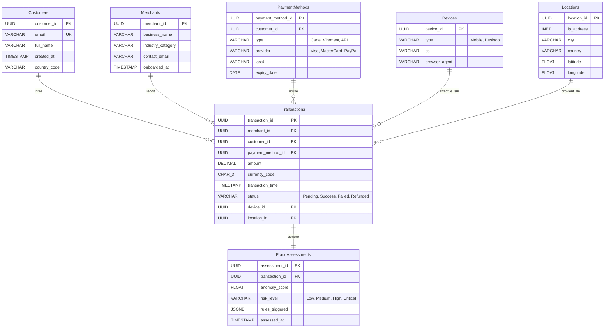

# Diagramme ERD - Modèle OLTP

Ce schéma est conçu pour le système transactionnel principal de Stripe. Il repose sur une normalisation en 3NF pour garantir l'intégrité des données (ACID), réduire la redondance et optimiser les performances en écriture sur de gros volumes.

---

## Diagramme Entité-Relation



---

## DBML (dbdiagram.io)

```dbml
Table Customers {
  customer_id UUID [pk]
  email VARCHAR [unique]
  full_name VARCHAR
  created_at TIMESTAMP
  country_code VARCHAR
}

Table Merchants {
  merchant_id UUID [pk]
  business_name VARCHAR
  industry_category VARCHAR
  contact_email VARCHAR
  onboarded_at TIMESTAMP
}

Table PaymentMethods {
  payment_method_id UUID [pk]
  customer_id UUID [ref: > Customers.customer_id]
  type VARCHAR [note: 'Carte, Virement, API']
  provider VARCHAR [note: 'Visa, MasterCard, PayPal']
  last4 VARCHAR
  expiry_date DATE
}

Table Transactions {
  transaction_id UUID [pk]
  merchant_id UUID [ref: > Merchants.merchant_id]
  customer_id UUID [ref: > Customers.customer_id]
  payment_method_id UUID [ref: > PaymentMethods.payment_method_id]
  amount DECIMAL
  currency_code CHAR(3)
  transaction_time TIMESTAMP
  status VARCHAR [note: 'Pending, Success, Failed, Refunded']
  device_id UUID [ref: > Devices.device_id]
  location_id UUID [ref: > Locations.location_id]
}

Table Devices {
  device_id UUID [pk]
  type VARCHAR [note: 'Mobile, Desktop']
  os VARCHAR
  browser_agent VARCHAR
}

Table Locations {
  location_id UUID [pk]
  ip_address INET
  city VARCHAR
  country VARCHAR
  latitude FLOAT
  longitude FLOAT
}

Table FraudAssessments {
  assessment_id UUID [pk]
  transaction_id UUID [ref: - Transactions.transaction_id]
  anomaly_score FLOAT
  risk_level VARCHAR [note: 'Low, Medium, High, Critical']
  rules_triggered JSONB
  assessed_at TIMESTAMP
}
```

---

## Décisions de Conception

**Normalisation 3NF :** Les tables `Devices` et `Locations` sont séparées de `Transactions` pour éviter la duplication massive de chaînes de caractères (ex : "Chrome on MacOS" répété des millions de fois). De même, `PaymentMethods` est séparé de `Customers` pour permettre plusieurs méthodes par client sans dupliquer les informations personnelles.

**Types de données :** Les UUIDs sont utilisés pour toutes les clés primaires afin de garantir l'unicité globale en environnement distribué (essentiel pour le sharding futur). Le type `DECIMAL` est imposé pour les montants financiers — les flottants introduiraient des erreurs d'arrondi inacceptables. Le type `INET` est le type natif PostgreSQL pour les adresses IP.

**Fraude séparée :** `FraudAssessments` est une table dédiée (relation 1:1 optionnelle) pour permettre un traitement asynchrone de l'analyse de risque sans verrouiller la transaction principale, et pour stocker les résultats complexes (règles déclenchées en JSONB) séparément.

### Indexation

| Index | Colonne(s) | Usage |
|-------|-----------|-------|
| `idx_tx_merchant_time` | `(merchant_id, transaction_time)` | Dashboards marchands |
| `idx_tx_customer` | `(customer_id)` | Historique client |
| `idx_tx_status` | `(status)` | Monitoring opérationnel |
| `idx_pending_tx` | `(status) WHERE status='Pending'` | File fraude (index partiel) |

---

## Requêtes de Validation

**Q1 — Historique client** (app mobile)
```sql
SELECT t.transaction_id, m.business_name, t.amount, t.currency_code, t.status, t.transaction_time
FROM Transactions t
JOIN Merchants m ON t.merchant_id = m.merchant_id
WHERE t.customer_id = 'cst_12345'
ORDER BY t.transaction_time DESC LIMIT 20;
```

**Q2 — Transactions haut risque** (analystes fraude)
```sql
SELECT t.transaction_id, t.amount, c.email, f.risk_level, f.anomaly_score
FROM Transactions t
JOIN FraudAssessments f ON t.transaction_id = f.transaction_id
JOIN Customers c ON t.customer_id = c.customer_id
WHERE f.risk_level IN ('High', 'Critical') AND t.status = 'Pending'
ORDER BY f.anomaly_score DESC;
```
