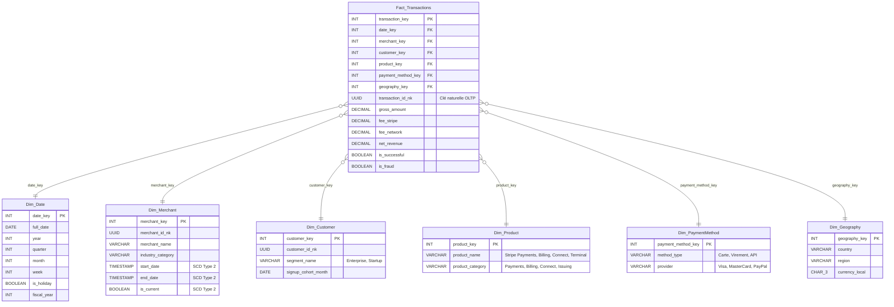

# Diagramme OLAP - Schéma Analytique

L'entrepôt de données utilise un **schéma en étoile (Star Schema)**, choisi pour sa performance en requêtage et sa lisibilité par les outils BI et les utilisateurs métier.

---

## Schéma en Étoile



---

## Vues Matérialisées (Pré-agrégation)

Pour garantir des temps de réponse inférieurs à la seconde sur les dashboards, deux vues matérialisées pré-calculent les métriques les plus demandées :

| Vue | Group By | Métriques | Usage |
|-----|----------|-----------|-------|
| `Agg_Daily_Revenue_Merchant` | `date_key`, `merchant_key` | SUM(gross_amount), SUM(net_revenue), COUNT(*) | Dashboards marchands |
| `Agg_Monthly_Global_Performance` | `month`, `geography_key`, `industry_category` | SUM(gross_amount), AVG(fee_stripe) | Reporting exécutif |

---

## DBML (dbdiagram.io)

```dbml
Table Fact_Transactions {
  transaction_key int [pk, increment]
  date_key int [ref: > Dim_Date.date_key]
  merchant_key int [ref: > Dim_Merchant.merchant_key]
  customer_key int [ref: > Dim_Customer.customer_key]
  product_key int [ref: > Dim_Product.product_key]
  payment_method_key int [ref: > Dim_PaymentMethod.payment_method_key]
  geography_key int [ref: > Dim_Geography.geography_key]
  transaction_id_nk uuid
  gross_amount decimal
  fee_stripe decimal
  fee_network decimal
  net_revenue decimal
  is_successful boolean
  is_fraud boolean
}

Table Dim_Date {
  date_key int [pk]
  full_date date
  year int
  quarter int
  month int
  week int
  is_holiday boolean
  fiscal_year int
}

Table Dim_Merchant {
  merchant_key int [pk]
  merchant_id_nk uuid
  merchant_name varchar
  industry_category varchar
  start_date timestamp
  end_date timestamp
  is_current boolean
}

Table Dim_Customer {
  customer_key int [pk]
  customer_id_nk uuid
  segment_name varchar
  signup_cohort_month date
}

Table Dim_Product {
  product_key int [pk]
  product_name varchar [note: 'Stripe Payments, Stripe Billing, Stripe Connect, Stripe Terminal']
  product_category varchar [note: 'Payments, Billing, Connect, Issuing']
}

Table Dim_PaymentMethod {
  payment_method_key int [pk]
  method_type varchar [note: 'Carte, Virement, API']
  provider varchar [note: 'Visa, MasterCard, PayPal']
}

Table Dim_Geography {
  geography_key int [pk]
  country varchar
  region varchar
  currency_local char(3)
}
```

---

## Décisions de Conception

**Clés substituts (Surrogate Keys) :** Les jointures utilisent des entiers (`_key`) au lieu des UUIDs de l'OLTP pour améliorer les performances dans le stockage colonnaire. Les UUIDs sont conservés comme clés naturelles (`_nk`) pour la traçabilité vers le système source.

**SCD Type 2 sur Dim_Merchant :** La dimension Marchand utilise le pattern Slowly Changing Dimension Type 2 pour conserver l'historique des changements (nom commercial, catégorie). Si un marchand change de catégorie, ses anciennes transactions restent liées à l'ancienne catégorie dans les rapports historiques.

**Dim_Product :** La dimension Produit segmente les transactions par ligne de produit Stripe (Payments, Billing, Connect, Terminal). Bien que la cardinalité soit faible, cette dimension est essentielle pour l'analyse croisée du revenu par produit et par marchand.

**Dim_PaymentMethod :** La dimension Méthode de Paiement permet d'analyser les revenus par type (carte, virement, API) et par fournisseur (Visa, MasterCard, PayPal). C'est un axe d'analyse métier clé pour comprendre les préférences de paiement et optimiser les coûts réseau.

**Pré-agrégation :** Les vues matérialisées évitent de rescanner des milliards de lignes à chaque actualisation de dashboard, répondant à l'exigence de métriques de revenus instantanées.

---

## Requêtes de Validation

**Q1 — Rapport revenus quotidien** (BI)
```sql
SELECT d.full_date, g.region,
    SUM(f.gross_amount) AS total_brut, SUM(f.net_revenue) AS total_net, COUNT(*) AS nb_tx
FROM Fact_Transactions f
JOIN Dim_Date d ON f.date_key = d.date_key
JOIN Dim_Geography g ON f.geography_key = g.geography_key
WHERE d.year = 2024 AND d.month = 1
GROUP BY 1, 2 ORDER BY 1 DESC, 3 DESC;
```

**Q2 — Analyse de cohortes** (stratégie produit)
```sql
SELECT c.signup_cohort_month, d.month AS mois_activite, SUM(f.gross_amount) AS depenses_cohorte
FROM Fact_Transactions f
JOIN Dim_Customer c ON f.customer_key = c.customer_key
JOIN Dim_Date d ON f.date_key = d.date_key
WHERE d.full_date >= c.signup_cohort_month
GROUP BY 1, 2 ORDER BY 1, 2;
```
