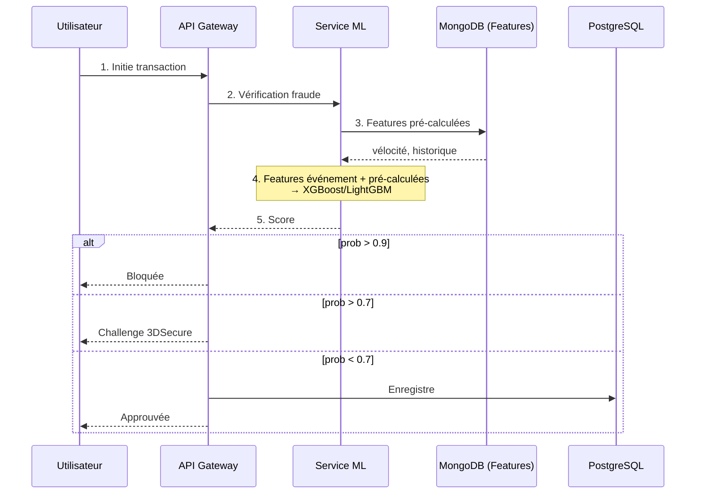
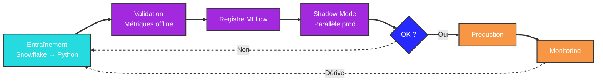

# Stratégie d'Intégration Machine Learning

Ce document décrit comment les modèles de Machine Learning s'intègrent dans l'architecture de données, principalement pour la **détection de fraude en temps réel** et la **personnalisation client**.

---

## 1. Feature Store

Le Feature Store résout le problème majeur du ML en production : les données d'entraînement (historiques) doivent correspondre exactement aux données de prédiction (temps réel). Il se compose de deux stores :

- **Online Store (MongoDB ou Redis) :** Valeurs actuelles des features pour l'inférence temps réel (ex : `last_1h_txn_count: 5`, `avg_spend_30d: 200.50`). MongoDB est choisi pour ses lectures clé-valeur rapides (ms) et son schéma flexible.
- **Offline Store (Snowflake) :** Valeurs historiques des features pour l'entraînement des modèles avec correction point-in-time.

---

## 2. Détection de Fraude Temps Réel

L'ensemble du processus (étapes 1 à 5) doit s'exécuter en **< 100ms**. Le service ML récupère les features pré-calculées depuis MongoDB (vélocité utilisateur, historique de dépenses), les combine avec les features de l'événement en cours (montant, appareil), puis le modèle (XGBoost/LightGBM) prédit la probabilité de fraude.

---

## 3. MLOps — Cycle de Vie

- **Entraînement :** Déclenché de façon hebdomadaire ou par dérive de performance. Lecture des données historiques depuis Snowflake, entraînement en Python (Scikit-learn/PyTorch), enregistrement dans un Model Registry (MLflow).
- **Déploiement :** Le modèle est servi comme API REST conteneurisée (FastAPI) sur Kubernetes.
- **Shadow Mode :** Avant promotion en production, le nouveau modèle tourne en parallèle de l'existant sans bloquer les utilisateurs, pour valider ses performances sur du trafic réel.

---

## 4. Monitoring et Rétroaction

### Vérité terrain
La validation des prédictions repose sur deux sources retardées :
- **Rétrofacturations** (semaines) : Le client conteste la transaction — label retardé.
- **Revue manuelle** (jours) : Les analystes examinent les transactions signalées.

### Métriques surveillées

- **Prédictions vs réalité** : Comparaison des distributions de scores avec la vérité terrain (Prometheus + Grafana).
- **Dérive des features** : Détection de changements anormaux, par exemple un montant moyen qui double soudainement (Evidently AI).
- **Qualité des données** : Contrôles de fraîcheur et complétude des features (dbt tests + alertes).
